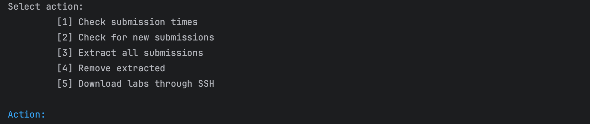
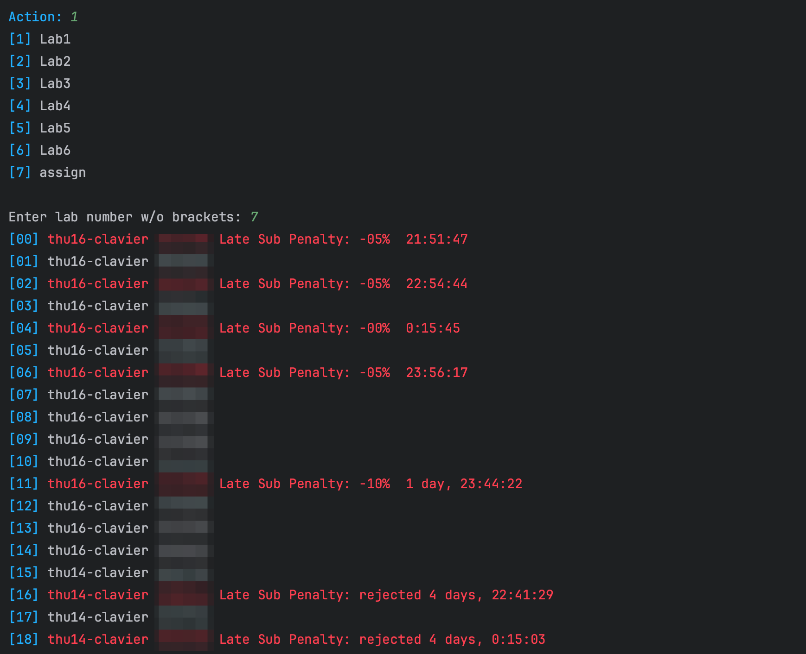
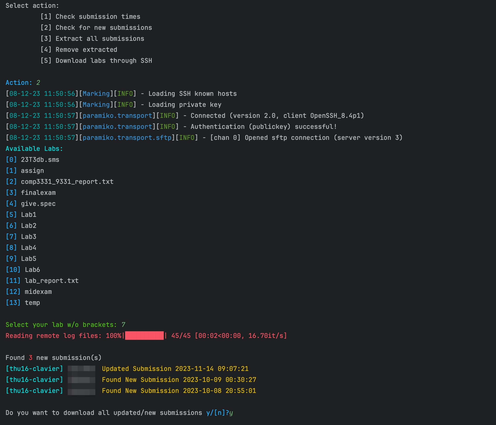
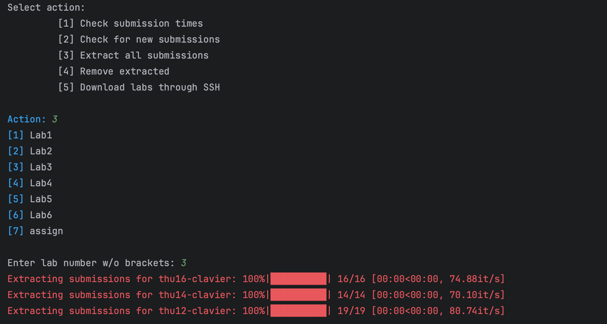
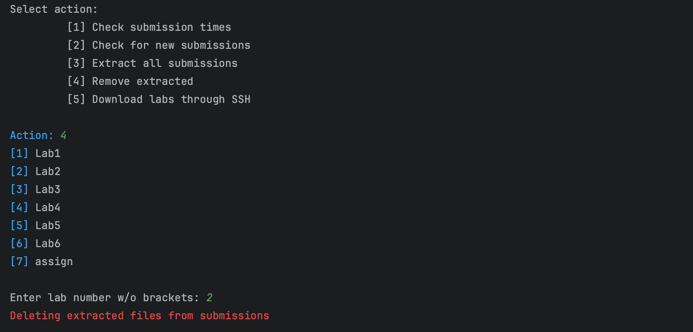
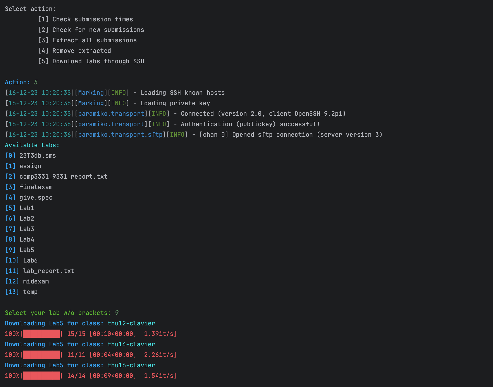
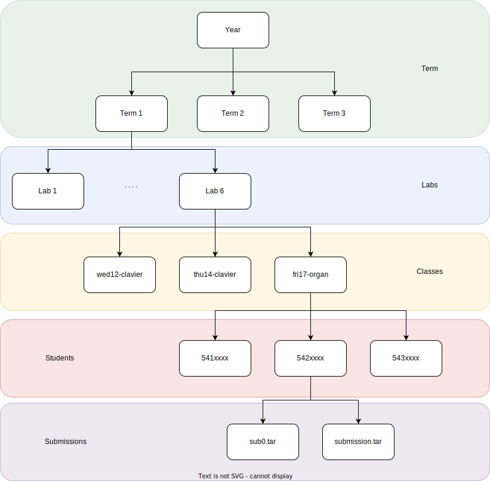

# COMP 3331 Lab Marking Helper

This python package consists of few scripts that I have written to make life easier during marking lab submissions. 
It was developed in a *macOS* environment, hence in its current state it will most probably not work on Windows due to 
how path naming works. However, it might work on linux distros (Haven't tested yet). Documentation for the code can be 
found [here](https://ravinsg.github.io/LabMarker).

## Installation 

This package is written with [Python](https://www.python.org/downloads/)(>=3.8). Run the following command to install 
dependencies before using the package. 

```
pip install -r requirements.txt
```

## SSH Configuration

This packages supports both password authentication and public-key based authentication. The host name and username can 
be specified in the [config.yaml](config.yaml) file under the connection parameter.

If you intend to use key based authentication, you need to provide the _path to the private key_ on your machine under 
**connection.private_key** in the config file. 

If you intend to use a password, set the **connection.use_pass** to **True** and you will be prompted to enter the password 
when logging in to the cse server.

## Usage

Currently, there are five main functionalities implemented in the package.

1. Check late submissions 
2. Check whether there are new/updated submissions after downloading a lab
3. Extract all submission.tar files
4. Remove all extracted files and revert the submission to as it was downloaded
5. Download submissions through SSH from the CSE server 



### Check Late Submissions

To submission deadline is read from the [config.yaml](config.yaml) file. Change marking.deadline.cur variable to the 
deadline of the lab you want to check late submissions of.



### Updated Submissions

If you want to check if there are new or updated submissions after the last download of the labs, run this command and 
select the lab you want to check updated submissions from. If there are new/updated submissions, you can directly 
download them through the command.



### Extract Submissions

This command will list down all downloaded labs on your local machine, and you can select which lab you want to extract 
the submissions from.



### Delete Extracted Submissions

This command will remove all extracted submissions and return the state of the directory to when it was downloaded.




### Download Submissions

Use this command to download submissions from the CSE server to your local machine. This will list all available  labs 
on the server, and you can select which lab you want to download. This will be saved in the location specified by 
**paths.local_lab_path** in the [config.yaml](config.yaml) file.



## Folder Structure
The script expects the downloaded submissions to be in the following file structure.

```
├── 23T3
│   ├── Assign
│   ├── Lab6
│   │   ├── wed12-clavier
│   │   ├── thu12-clavier
│   │   │   ├── 541xxxx
│   │   │   ├── 541xxxx
│   │   │   │   ├── log
│   │   │   │   └── submission.tar
│   │   │   ├── ...
│   │   │   └── 541xxxx
│   │   └── fri17-organ
│   ├── ...
│   └── Lab1
├── 23T2
│   ├── Assign
│   ├── ...
│   └── Lab1
└──23T1
```
See below figure for more details. Variable naming in the code also follows the same structure.

