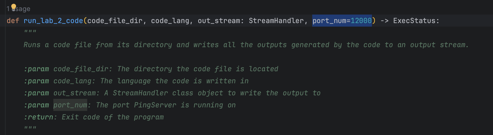
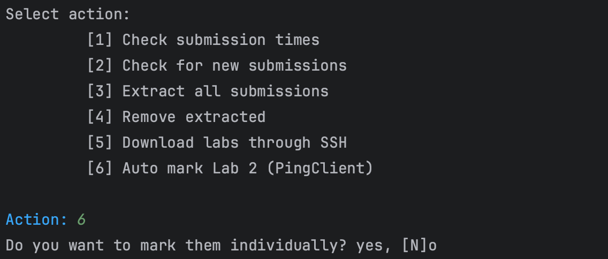
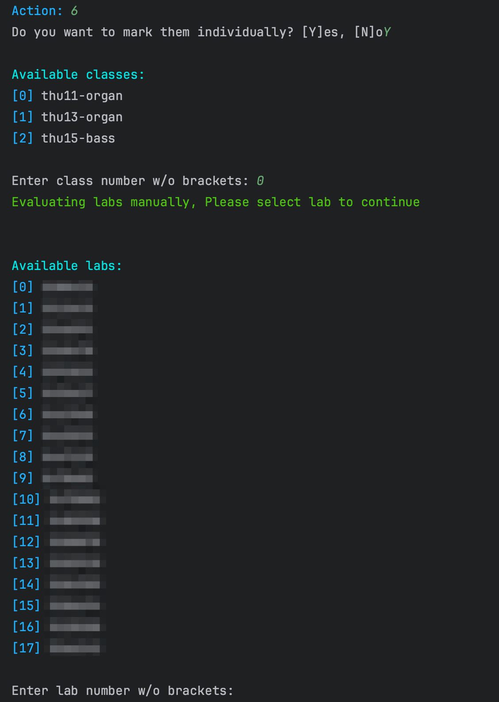
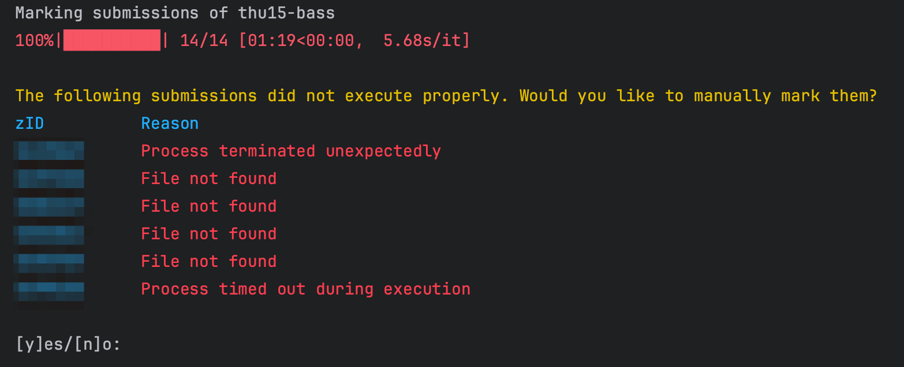

### Setting the port number
The default port number used is `12000`, if you want to change this it can be found under [marker.py](marker.py) `line 46`.

### Running the auto marker
Run the ping server on the same port you selected above and execute the LabMarker script and select the option `[6] Auto mark Lab 2 (PingClient)`. You will be then prompted with the following:

### Selecting marking mode
If you want to mark a selected submission, type `Y` and press enter. You will be first prompted to select the class and then the submission as follows.

Once a submission is selected, only the PingClient of that submission will be evaluated. After a successful evaluation, the above selection will be prompted again.

### Automated marking

If individual marking is not selected, the script will iterate through the submissions of each class and try to execute them automatically. The output of each submitted script will be saved in the folder `outputs/lab2`.

You can then verify whether the outputs are correct and mark them accordingly. The script will also try to automatically detect failed runs, however this is not 100% accurate at the moment. Only submissions written in Python and Java will be run automatically, for C programs you will have to execute them manually.

### Failed executions
After executing all submissions in a class, if there are any failed executions, they will be listed as follows.

You can then select to inspect the code files submitted and remark them manually if the errors can be fixed. For example, if the student has not named the file as PingClient, it will throw a `File not found` error. Simply rename the file and remark the submission and it should work.